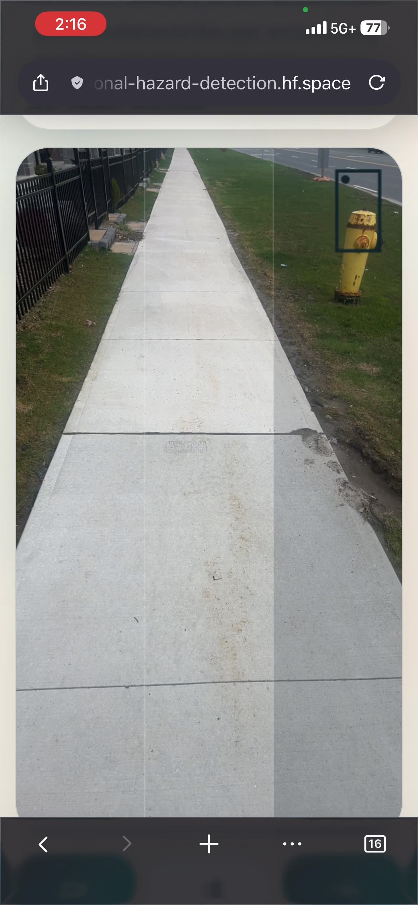
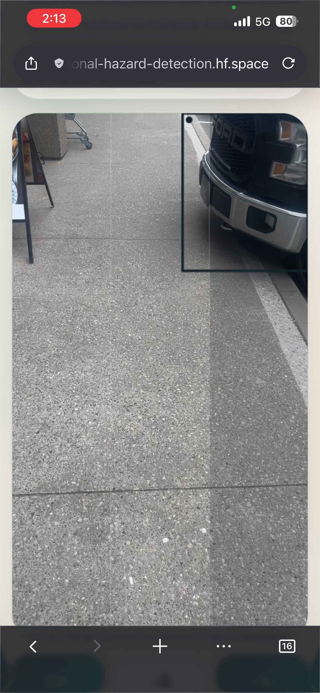
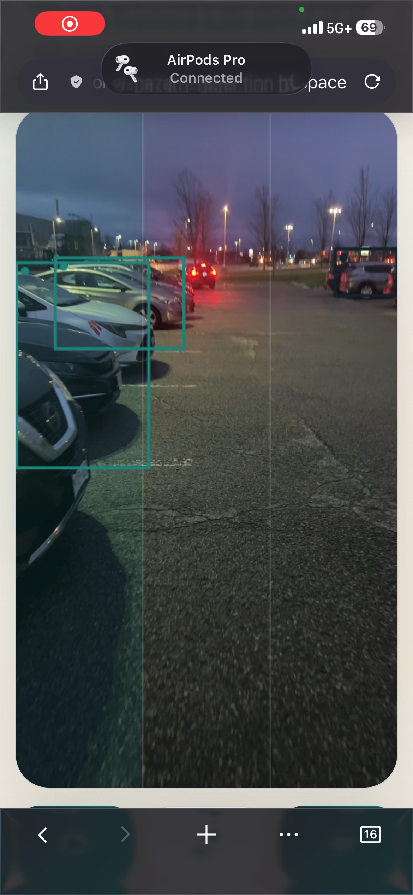

The website is available at: https://mohabs3-directional-hazard-detection.hf.space

Does not work on Safari on iOS.

# Directional Hazard Detection System

An accessibility-focused computer-vision web app that helps visually impaired users detect hazards in real time. The user opens the site on a phone, grants camera access, and the app speaks directional alerts — *"Car ahead"*, *"Person on the left"* — as objects appear in the camera feed.

The app is a Flask backend, a mobile-first vanilla-JS frontend, and a pretrained Ultralytics **YOLOv8** detector. It is packaged as an installable Progressive Web App (PWA) so it can be added to a phone's home screen and
launched like a native app.

## How it works

Every ~1 second while the camera is live:

1. **Browser** — captures a frame from the video element into a hidden canvas and encodes it as a JPEG data URL.
2. **Backend** — `POST /api/live-detect` decodes the frame and runs YOLOv8 (`yolov8n.pt`) via the `ObjectDetector` class.
3. **Direction logic** — each detection's bounding-box center is bucketed into
   *left / center / right* thirds of the frame. Detections are prioritized by
   hazard class (person, car, bicycle, …) then by bounding-box area.
4. **Response** — JSON payload with `summary_text`, `primary_direction`,
   `has_hazard`, and the top detections.
5. **Frontend** — draws colored bounding boxes over the live video and, when
   `has_hazard` is true, speaks the summary via the browser's
   `SpeechSynthesis` API. When the path is clear the app stays silent.

## Tech stack

- **Backend:** Python 3, Flask, OpenCV, Ultralytics YOLOv8 (`yolov8n.pt`)
- **Frontend:** HTML, Tailwind (via CDN), vanilla JS, Canvas 2D overlay
- **Audio:** browser-native `SpeechSynthesis` (no cloud TTS)
- **PWA:** `manifest.webmanifest`, service worker with offline app-shell cache,
  maskable icons, iOS meta tags

## Project structure

```
Directional-Hazard-Detection-System/
├── app.py                       # Flask entrypoint + routes
├── live_detection.py            # Frame decode, YOLO call, direction logic
├── detectors/
│   └── object_detector.py       # Ultralytics YOLOv8 wrapper
├── templates/
│   ├── base.html                # PWA meta tags + service worker registration
│   └── index.html               # Camera stage + control dock
├── static/
│   ├── app.js                   # Camera capture, detection loop, TTS
│   ├── styles.css
│   ├── manifest.webmanifest
│   ├── service-worker.js        # App-shell cache (API is never cached)
│   └── icons/                   # PWA icons (192, 512, maskable, apple-touch)
├── yolov8n.pt                   # Pretrained YOLOv8 weights
└── requirements.txt
```

## Endpoints

| Method | Path                      | Purpose                                         |
|--------|---------------------------|-------------------------------------------------|
| GET    | `/`                       | PWA shell (camera UI)                           |
| POST   | `/api/live-detect`        | Body: `{image: <jpeg data URL>}` → JSON result  |
| GET    | `/health`                 | Liveness probe (`{"status": "ok"}`)             |
| GET    | `/manifest.webmanifest`   | PWA manifest (also served from `/static/`)      |
| GET    | `/service-worker.js`      | Service worker (scoped to `/`)                  |

## Screenshots

<table>
  <tr>
    <td></td>
    <td></td>
    <td></td>
  </tr>
</table>

## Deployment

The app is deployed as a **Docker Space on Hugging Face Spaces** (CPU Basic tier, free, 16 GB RAM). Everything the Space needs lives in this repo. The link is https://mohabs3-directional-hazard-detection.hf.space. 

## Videos 
Videos are available on Google Drive: 
https://drive.google.com/file/d/13oX9Spzf1nRqVPqxjc_fLGuqzCw_PXck/view?usp=sharing 